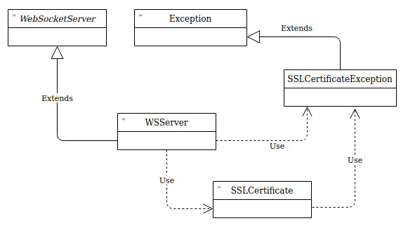

# TemplateWebsocketSSL

## Descrição
O TemplateWebsocketSSL é um projeto Java que demonstra como implementar um servidor websocket SSL com certificado auto-assinado.

## Tecnologias
As tecnologias e recursos utilizados no projeto TemplateWebsocketSSL estão listados abaixo.

* Java 11 (como linguagem de desenvolvimento)
* Apache Maven 3 (como gerenciador de build)
* Biblioteca TooTallNate/Java-WebSocket

## Certificado auto-assinado
Para gerar um certificado auto-assinado para o servidor Websocket SSL, deve-se utilizar a ferramenta 'keytool' presente no pacote JDK.

```
$ JAVA_HOME/bin/keytool \
    -genkeypair \
    -alias <nome-alias> \
    -keyalg RSA \
    -keypass <senha> \
    -keystore <path>/<nome-arquivo>.jks \
    -storepass <senha> \
    -dname "cn=<nome-empresa>, ou=<nome-departamento>, o=<nome-empresa>, L=<nome-cidade>, ST=<sigla-estado>, c=<sigla-pais>"
```

## Documentação

### Diagrama de classes

 

## Release History

* 1.0.0
    * Primeira versão
